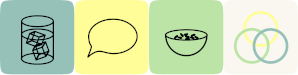

# Spirits & Tongues

an incomplete list of my obsessions

---

## Episodes


{% assign currentTime = 'now' | date: '%s' %}


{% assign episodeTime = episode.date | date: '%s' %}


<h3>Episode {{episode.number}}: {{episode.title}}</h3>


{{episode.episodeId}}



{{episode.content}}



